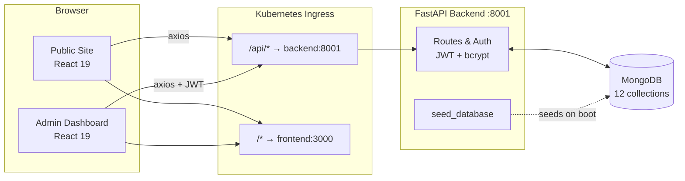

<div align="center">

# 🛍️ StyleHub

### Digital Boutique Showcase & Inventory Platform

**A production-ready digital showroom and inventory back-office for a physical clothing boutique.**
Customers browse and fall in love online — then call, message, or walk in to buy.
The shop owner runs the entire catalogue, CMS, and analytics from one admin dashboard.


[**🔗 Live Demo**](https://style-hub-tau-ruby.vercel.app/) · [Admin Login](https://style-hub-tau-ruby.vercel.app/admin/login) · [Report an Issue](#-faq)

</div>

---

> **Not an e-commerce site.** There is intentionally **no cart and no online checkout** — StyleHub is a digital showroom. Customers discover, filter, and shortlist products, then reserve or buy in person via **Call / WhatsApp / Visit**.

## 📑 Table of Contents

- [Preview](#-preview)
- [Overview](#-overview)
- [Key Features](#-key-features)
- [Tech Stack](#-tech-stack)
- [Architecture](#-architecture)
- [Folder Structure](#-folder-structure)
- [Getting Started](#-getting-started)
- [Environment Variables](#-environment-variables)
- [Admin / Demo Credentials](#-admin--demo-credentials)
- [Seed Data](#-seed-data)
- [REST API Reference](#-rest-api-reference)
- [Data Models](#-data-models)
- [Frontend Architecture](#-frontend-architecture)
- [Design System](#-design-system)
- [Security](#-security)
- [Testing](#-testing)
- [Roadmap](#-roadmap)
- [FAQ](#-faq)
- [Contributing](#-contributing)
- [License](#-license)

---

## 🖼️ Preview

<div align="center">

| Public Site | Admin Dashboard |
|:---:|:---:|
|  |  |
| **Home** — editorial hero, new arrivals, gallery & testimonials | **Dashboard** — KPI cards, category chart, most-viewed products |
|  |  |
| **Products** — sidebar filters, sortable grid, image-zoom on hover | **Products** — inline stock adjust, modal CRUD form, low-stock filter |
|  |  |
| **Product Detail** — multi-image gallery, size/color pickers, in-store CTAs | **Inquiries** — status tabs, detail modal, mailto/tel quick actions |

</div>

> 📸 Drop your own captures into `docs/screenshots/` using the filenames above (recommended: **1280×800px, PNG**) and they'll render automatically here. Good pages to capture: `/`, `/products`, `/products/onyx-wool-blazer`, `/admin/login`, `/admin`, `/admin/products`, `/admin/inquiries`.

---

## ✨ Overview

**StyleHub** is a luxury-fashion digital showroom built for a single boutique. Customers use it to discover products, filter by what matters to them, save favorites to a wishlist, and reach out to the store to reserve or buy — the entire purchase moment happens in person.

Behind the scenes, the shop owner gets a full admin dashboard to manage:

- 🧥 Products, categories, brands, and inventory — with stock adjustments and low-stock alerts
- 🏷️ Offers, homepage banners, gallery images, and testimonials
- 💬 Customer inquiries, triaged by status
- ⚙️ Store settings — name, tagline, address, business hours, map coordinates, socials, about
- 📊 Analytics — top-viewed products, stock value, category distribution

---

## 🔑 Key Features

### Public Site (customer-facing)

| Area | Features |
|---|---|
| **Home** | Editorial hero, category strip, new-arrivals bento, trending section, promo banner, best sellers, editor's edit, brands marquee, offers, gallery, testimonials, business hours + Google map |
| **Products** | Filter by category, brand, gender, price range, and collection flags (Featured / New / Trending / Best Seller / On Offer). Sort by newest, price, or name. Filters are URL-driven and shareable. |
| **Product Detail** | Multi-image gallery with click-to-zoom modal, size & color pickers, WhatsApp / Call / Visit / Wishlist CTAs, breadcrumb, material/pattern/fit details, care instructions, related products, share/copy-link |
| **Categories / Brands / Offers / Gallery** | Dedicated listing pages with editorial layouts. Gallery includes category tabs and a lightbox. |
| **About / Contact / Privacy / Terms / 404** | Full supporting page set. Contact form persists directly to the database. |
| **Wishlist** | Browser-local, no login required. Persists across sessions via `localStorage`, with a live counter in the navbar. |
| **Newsletter** | Footer subscription form → backend, deduplicated by email. |
| **Theme** | Light / dark mode toggle, persisted across visits. |
| **Currency** | Indian Rupee (₹) formatted with `en-IN` digit grouping, e.g. `₹1,29,000`. |

### Admin Dashboard (owner-only)

| Area | Features |
|---|---|
| **Login** | JWT-based auth, demo credentials pre-filled for convenience. |
| **Dashboard** | 8 metric cards (Products, Categories, Brands, Offers, Inquiries, Low Stock, Newsletter, Stock Value), a by-category bar chart (Recharts), and a most-viewed products list. |
| **Products** | Rich table with thumbnails, inline stock +/− buttons, and a full modal form covering every field, flag, and image URL with live previews. Low-stock filter via `?low=1`. |
| **Categories / Brands / Offers / Banners / Gallery / Testimonials** | Table + modal CRUD, all powered by a single reusable `CrudManager` component. |
| **Inquiries** | Tabbed by status (new / read / replied / archived), with a detail modal, mailto/tel quick links, status transitions, and delete. |
| **Store Settings** | Edit store name, tagline, about copy, contact details, address, map coordinates, 7-day business hours, and 4 social links. |

### Under the Hood

- Auto-seeded MongoDB on first startup — admin user, 12 products, 6 categories, 6 brands, 3 offers, 3 banners, 6 gallery items, 3 testimonials, and default settings.
- JWT with 7-day expiry, auto-attached via an Axios interceptor; a 401 response redirects to `/admin/login`.
- Product `views` increments on every detail fetch, surfacing in the "most viewed" widget.
- Stock adjustments are logged to a `stock_history` collection for future auditing.
- Search is case-insensitive across name, description, SKU, and tags.
- SEO-ready: dynamic meta descriptions, preconnected Playfair + Manrope fonts, semantic markup, and proper heading hierarchy.

---

## 🧱 Tech Stack

**Frontend**
`React 19` (CRA via `craco`) · `React Router 7` · `TanStack Query 5` · `Axios` · `Tailwind CSS 3` + `shadcn/ui` · `Framer Motion` · `Recharts 3` · `Sonner` · `Lucide React` · `Playfair Display` + `Manrope`

**Backend**
`FastAPI 0.110` · `Motor 3.3` (async MongoDB driver) · `Pydantic 2` · `PyJWT` + `bcrypt` · `uvicorn` · `python-dotenv`

**Database**
`MongoDB` — 12 collections: `users`, `products`, `categories`, `brands`, `offers`, `gallery`, `banners`, `testimonials`, `inquiries`, `newsletter`, `stock_history`, `settings`

**Deployment (this preview)**
`Supervisor` process manager · Kubernetes ingress (`/api/*` → backend:8001, everything else → frontend:3000) · hot reload enabled on both services

---

## 🏗️ Architecture



---

## 📂 Folder Structure

```
/app
├── backend/
│   ├── server.py                  # FastAPI app: models, routes, auth, seed_database()
│   ├── requirements.txt
│   └── .env                       # MONGO_URL, DB_NAME, CORS_ORIGINS, JWT_SECRET
├── frontend/
│   ├── public/
│   │   └── index.html             # Google Fonts preconnect; SEO meta
│   ├── src/
│   │   ├── App.js                 # Router: public + admin routes
│   │   ├── index.js               # QueryClient + entry
│   │   ├── index.css              # Design tokens (CSS vars), utilities
│   │   ├── lib/
│   │   │   ├── api.js             # Axios client + publicApi wrappers
│   │   │   ├── format.js          # formatINR() helper
│   │   │   └── utils.js           # cn() classnames
│   │   ├── context/
│   │   │   ├── AuthContext.jsx    # Login / logout / user
│   │   │   ├── WishlistContext.jsx# localStorage wishlist
│   │   │   └── ThemeContext.jsx   # Light / dark
│   │   ├── components/
│   │   │   ├── ProductCard.jsx
│   │   │   ├── layout/
│   │   │   │   ├── Navbar.jsx
│   │   │   │   ├── Footer.jsx
│   │   │   │   ├── PublicLayout.jsx
│   │   │   │   └── AdminLayout.jsx
│   │   │   ├── admin/
│   │   │   │   └── CrudManager.jsx  # Generic table + modal CRUD
│   │   │   └── ui/                 # shadcn primitives
│   │   └── pages/
│   │       ├── Home.jsx
│   │       ├── Products.jsx
│   │       ├── ProductDetail.jsx
│   │       ├── Categories.jsx
│   │       ├── Brands.jsx
│   │       ├── Offers.jsx
│   │       ├── Gallery.jsx
│   │       ├── About.jsx
│   │       ├── Contact.jsx
│   │       ├── Wishlist.jsx
│   │       ├── Privacy.jsx
│   │       ├── Terms.jsx
│   │       ├── NotFound.jsx
│   │       └── admin/
│   │           ├── AdminLogin.jsx
│   │           ├── AdminDashboard.jsx
│   │           ├── AdminProducts.jsx
│   │           ├── AdminCategories.jsx
│   │           ├── AdminBrands.jsx
│   │           ├── AdminOffers.jsx
│   │           ├── AdminBanners.jsx
│   │           ├── AdminGallery.jsx
│   │           ├── AdminTestimonials.jsx
│   │           ├── AdminInquiries.jsx
│   │           └── AdminSettings.jsx
│   └── package.json
├── docs/
│   └── screenshots/                # Drop preview images here (see Preview section)
├── memory/
│   ├── PRD.md
│   └── test_credentials.md
└── README.md                      # (this file)
```

---

## 🚀 Getting Started

> The Emergent preview environment already runs this app under **supervisor** — there's nothing to install. The steps below are only for self-hosting.

### Prerequisites

- Python **3.11+**
- Node **18+** and **yarn**
- **MongoDB** running locally on `mongodb://localhost:27017` (or set `MONGO_URL`)

### 1. Backend

```bash
cd backend
pip install -r requirements.txt
uvicorn server:app --host 0.0.0.0 --port 8001 --reload
```

On first startup, `seed_database()` automatically populates the admin user, categories, brands, products, offers, banners, gallery, and testimonials.

### 2. Frontend

```bash
cd frontend
yarn install
yarn start        # serves on http://localhost:3000
```

### 3. Open

- Public site → `http://localhost:3000`
- Admin login → `http://localhost:3000/admin/login`

---

## 🔐 Environment Variables

**`backend/.env`**
```env
MONGO_URL="mongodb://localhost:27017"
DB_NAME="test_database"
CORS_ORIGINS="*"
JWT_SECRET="change-me-in-production"
```

**`frontend/.env`**
```env
REACT_APP_BACKEND_URL=https://<your-backend-host>
WDS_SOCKET_PORT=443
```

> ⚠️ `REACT_APP_BACKEND_URL` must **not** include `/api` — the client appends it automatically.

---

## 👤 Admin / Demo Credentials

Seeded on first backend boot. The login form pre-fills them for convenience.

| Field | Value |
|---|---|
| URL | `/admin/login` |
| Email | `admin@stylehub.com` |
| Password | `Admin@12345` |
| Role | `admin` |

> 🔒 **Before deploying to production:** rotate `JWT_SECRET`, change this password (update the `users` collection, or edit `seed_database()` and reseed against a cleared database), and restrict `CORS_ORIGINS`.

---

## 🌱 Seed Data

Auto-created on backend startup — idempotent, only inserts if the collection is empty.

| Collection | Count | Notes |
|---|---|---|
| `users` | 1 | Admin owner |
| `categories` | 6 | Outerwear, Knitwear, Dresses, Shirts, Trousers, Accessories |
| `brands` | 6 | Maison Vela, Nord & Line, Atelier Kōgei, Ravello, House of Ember, Studio Neuve |
| `products` | 12 | Realistic garments with SKUs, sizes, colors, flags, and multiple images |
| `offers` | 3 | Cashmere Week, First-Look, Silk Slip Trio |
| `banners` | 3 | 2 hero + 1 promo |
| `gallery` | 6 | Store / event / product |
| `testimonials` | 3 | With avatar, quote, and role |
| `settings` | 1 | Default SoHo boutique — edit in `/admin/settings` |

To reseed: `mongosh <db>` → `db.dropDatabase()` → restart the backend.

---

## 🔌 REST API Reference

Base URL: `${REACT_APP_BACKEND_URL}/api`

### Auth

| Method | Path | Auth | Purpose |
|---|---|---|---|
| POST | `/auth/login` | Public | Returns `{ access_token, token_type, user }` |
| GET | `/auth/me` | Bearer | Current admin |

### Products

| Method | Path | Auth | Purpose |
|---|---|---|---|
| GET | `/products` | Public | List with filters (see below) |
| GET | `/products/{id_or_slug}` | Public | Product detail (increments `views`) |
| GET | `/products/{id}/related` | Public | Related items by category |
| POST | `/products` | Admin | Create |
| PUT | `/products/{id}` | Admin | Update |
| DELETE | `/products/{id}` | Admin | Delete |
| POST | `/products/{id}/stock?delta=N` | Admin | Adjust stock (± N), logs to `stock_history` |

**`GET /products` query params:** `q, category_id, brand_id, gender, min_price, max_price, size, color, featured, trending, new_arrival, best_seller, on_offer, active, sort (newest|price_asc|price_desc|name), limit, skip`

### Generic CRUD Endpoints (same shape)

- `GET|POST` → `/categories`, `/brands`, `/offers`, `/gallery`, `/banners`, `/testimonials`
- `GET|PUT|DELETE` → `/{resource}/{id}` (writes are admin-only)

### Inquiries & Newsletter

| Method | Path | Auth | Purpose |
|---|---|---|---|
| POST | `/inquiries` | Public | Submit contact form |
| GET | `/inquiries` | Admin | List (filter by `status_f`) |
| PUT | `/inquiries/{id}?status_v=X` | Admin | Change status |
| DELETE | `/inquiries/{id}` | Admin | Delete |
| POST | `/newsletter` | Public | Subscribe email (deduped) |

### Settings & Analytics

| Method | Path | Auth | Purpose |
|---|---|---|---|
| GET | `/settings` | Public | Store settings |
| PUT | `/settings` | Admin | Update settings |
| GET | `/analytics/summary` | Admin | KPIs + by-category + top-viewed |

> All list endpoints return `{ items: [...], total: N }`.

### Example: Authenticated Request

```bash
API=https://your-host

# Login
TOKEN=$(curl -s -X POST "$API/api/auth/login" \
  -H "Content-Type: application/json" \
  -d '{"email":"admin@stylehub.com","password":"Admin@12345"}' \
  | jq -r .access_token)

# List all products (including inactive)
curl -s "$API/api/products?limit=100" -H "Authorization: Bearer $TOKEN" | jq

# Adjust stock
curl -s -X POST "$API/api/products/<id>/stock?delta=-2" -H "Authorization: Bearer $TOKEN"
```

---

## 🗂️ Data Models

All documents use a **UUID `id`** as the primary key (not MongoDB's `_id`) and store timestamps as ISO strings (`created_at`, `updated_at`).

### Product

```json
{
  "id": "uuid",
  "name": "Ivory Cashmere Overcoat",
  "slug": "ivory-cashmere-overcoat",
  "sku": "MV-OC-01",
  "description": "...",
  "short_description": "...",
  "brand_id": "uuid|null",
  "category_id": "uuid|null",
  "subcategory_id": null,
  "gender": "men|women|unisex|kids",
  "price": 1290,
  "discount_price": 990,
  "stock": 8,
  "low_stock_threshold": 5,
  "sizes": ["XS", "S", "M", "L"],
  "colors": ["Ivory", "Camel"],
  "material": "100% Cashmere",
  "pattern": "Solid",
  "fit": "Relaxed",
  "sleeve": "Long",
  "washing_instructions": "Dry clean only.",
  "images": ["https://...", "..."],
  "featured": true,
  "trending": true,
  "new_arrival": true,
  "best_seller": false,
  "on_offer": true,
  "active": true,
  "tags": ["luxury", "winter", "cashmere"],
  "views": 42,
  "created_at": "...",
  "updated_at": "..."
}
```

Other models (`Category`, `Brand`, `Offer`, `Banner`, `Gallery`, `Testimonial`, `Inquiry`, `Settings`) follow the same conventions — see `backend/server.py` for the exact Pydantic classes.

---

## 🧩 Frontend Architecture

- **Provider stack** (in `App.js`): `ThemeProvider → AuthProvider → WishlistProvider → BrowserRouter`
- **Layouts**: `PublicLayout` (Navbar + Outlet + Footer) and `AdminLayout` (Sidebar + Outlet)
- **Data fetching**: TanStack Query everywhere, with cache invalidation on mutation success
- **Forms**: uncontrolled `react-hook-form` where useful; plain `useState` for admin CRUD modal forms
- **Toasts**: `sonner`, bottom-right
- **Money formatting**: always use `formatINR()` from `lib/format.js` instead of hard-coding `₹` / `$`
- **Test IDs**: every interactive element carries a kebab-case `data-testid`, ideal for E2E automation

### Adding a New Admin CRUD Page

1. Add a Pydantic model + generic route in `backend/server.py` (use `crud_router()`).
2. Create a new file under `pages/admin/`, defining `DEFAULT_ITEM`, `FIELDS`, and `COLUMNS` as module-level constants.
3. Return `<CrudManager />` with the endpoint, `testIdPrefix`, and configs.
4. Register the route in `App.js` and add the link in `AdminLayout.jsx`.

---

## 🎨 Design System

### Palette (light theme)

| Token | Value | Swatch |
|---|---|---|
| Background | `#FCFCFA` (off-white paper) |  |
| Foreground | `#0A0A0A` (near-black) |  |
| Secondary | `#F3F2F0` |  |
| Muted | `#EAE8E3` |  |
| Gold accent | `hsl(39 42% 55%)` |  |

Used sparingly — the period on the logo, the editorial dot, offer eyebrows. Dark theme mirrors the same tones on a `#0F0F0F` background.

### Typography

- **Headings** — `Playfair Display`, weights 400 / 500 / 700 / 900, tight tracking
- **Body / UI** — `Manrope`, weights 300–700
- **Eyebrow labels** — uppercase, `tracking-[0.24em]`, small-caps feel

### Motion

- `.image-zoom-wrap` — 6% scale on hover, 700ms cubic-bezier
- `.link-underline` — expanding underline on hover
- `.reveal` — 0.9s upward fade entrance
- `.marquee-track` — 40s linear infinite (brands strip)
- Respects `prefers-reduced-motion`

### Rules of the House

- No purple/violet gradients, no Inter for body text, no centered `text-align: center` on `.App`
- Sharp corners (`--radius: 0`) — the aesthetic is editorial, not "app-y"
- Generous whitespace: `.container-x` = `max-w-[1440px]` with `px-6 → px-14`

---

## 🛡️ Security

- **Passwords** — bcrypt hashed (`bcrypt.gensalt()`), never stored in plaintext
- **JWT** — HS256, 7-day expiry, signed with `JWT_SECRET`; rotate before production
- **CORS** — configurable via the `CORS_ORIGINS` env var
- **Input validation** — Pydantic 2 on every write endpoint, with enum validation on the gender field
- **Admin-only writes** — every mutating admin endpoint is guarded by `Depends(get_current_admin)`
- **View counter** — increments publicly without leaking product data
- **XSS** — React escapes by default; `dangerouslySetInnerHTML` is never used
- **Rate limiting / CSRF** — intentionally deferred, see [Roadmap](#-roadmap)

---

## ✅ Testing

### Backend (pytest)

25 tests covering auth, products (CRUD + filters + slug + related + stock), all CRUD resources, inquiries, newsletter dedupe, settings, and analytics.

```bash
cd backend
pytest tests/ -v
```

### Frontend (E2E via automated test agent)

100% pass rate on documented flows in `PRD.md`. Every interactive element carries a `data-testid` attribute (see `AdminLogin.jsx`, `ProductDetail.jsx`, etc. for naming conventions).

### Lint

```bash
# Frontend
cd frontend && yarn lint     # ESLint — currently zero errors, zero warnings

# Backend
ruff check backend/ || flake8 backend/
```

---

## 🗺️ Roadmap

Suggested next steps, based on items already flagged as deferred above:

- [ ] Rate limiting on public write endpoints (`/inquiries`, `/newsletter`)
- [ ] CSRF protection for admin mutations
- [ ] Native image upload (currently URL-only) with storage integration
- [ ] Pagination for large admin tables (currently full-list)
- [ ] Multi-currency support alongside INR
- [ ] Role-based access (e.g. staff vs. owner) beyond the single admin role
- [ ] Automated screenshot generation for this README

> This section is a starting point — adjust it to match your actual priorities.

---

## ❓ FAQ

**Why is there no cart or checkout?**
By design. StyleHub is a discovery layer for a physical boutique — the goal is to drive calls, WhatsApp messages, and store visits, not replace the in-person buying experience.

**How do I reset the admin password?**
Update the corresponding document in the `users` collection directly, or edit the credentials in `seed_database()` and reseed against a freshly cleared database.

**Can I run this without MongoDB running locally?**
Yes — point `MONGO_URL` in `backend/.env` at any reachable MongoDB instance (e.g. Atlas).

**Where do wishlist items live?**
In the browser's `localStorage`, per device — there's no account system on the public site, so wishlists aren't synced across devices.

**Is the seed data safe to keep in production?**
No — treat it as a starting template. Replace the demo admin credentials, products, and settings before going live.

---

## 🤝 Contributing

Issues and pull requests are welcome. Before opening a PR:

1. Run the backend test suite (`pytest tests/ -v`) and frontend lint (`yarn lint`).
2. Keep new admin pages consistent with the `CrudManager` pattern described in [Frontend Architecture](#-frontend-architecture).
3. Follow the existing `data-testid` naming convention for any new interactive elements.
